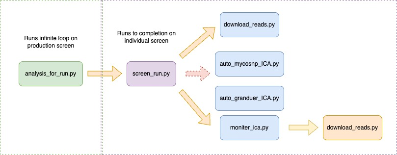

# General_LW_scripts
The scripts that UPHL uses to download things from basespace and run respective workflows

# USAGE

## daily_SARS-CoV-2_metadata.sh

daily_SARS-CoV-2_metadata.sh checks the date every 4 hours. If it is a new day, this script runs the Dripping Rock nextflow workflow to get the daily SARS-CoV-2 metadata file. On Sundays, it also takes the latest 20 runs and 10 random runs and creates a phylogenetic tree. This is a script that is run in a screen on the Production account.

## accession_for_clarity.py

accession_for_clarity.py is a script that creates an accessioning file for Clarity that has the new samples found in the Labware lims system that will be ready for the lab to process. The output of the script is a csv file, that must be saved as an excel file before Clarity will accept it. To be able to run the script you must have these two servers mounted on your computer; smb://172.16.109.9 and smb://168.180.220.43 or //LABWARE/ and ///DDCP/UPHL/. You also need to log into Clarity and download all samplesheets from projects with a name that starts with COVIDSeq, including the project COVIDSeq_From_TEST_DO_NOT_PUT_IN_WORKFLOW. Do this by going to the 'Projects and Samples' tab, choosing the correct project, and clicking the modify samples button. This will insure we do not place duplicates in Clarity which causes many issues.


Files will be downloaded from clicking the modify samples button. 

Now to run the script ```python accession_for_clarity.py "path/to/files/fromclarity" "path/to/files/fromclarity.etc"``` ...

The csv file that the script creates will be saved to the directory that you are running the script from. You must open the file in excel and save it to the excel file. Now back in Clarity click the button 'Upload Sample List' and choose the excel file.


Now click select group for the samples you just uploaded. Then choose 'Covidseq v1.0' after clicking 'Assign to Workflow'. And finally you are done!

# Automation Scripts for ICA 
Currently written for Pulsenet/ARLN samples that typically run on Grandeur and Mycosnp. The scripts are structured to run sequentially; and can be triggered manually or by the previous script. Each script send notifications to the UPHL slack channel to help monitor the progress of the sequencing analysis. These scripts use the python package of logging to track these scripts usage and track errors that occur while running. All scripts write to a log located at /Volumes/IDGenomics_NAS/Bioinformatics/jarnn/analysis_for_run.log.


## analysis_for_run.py
This script is written to run continuously on the Linux workstation on a screen. It's main purpose is to use the ```bs``` or "The BaseSpace Sequence Hub CLI tool" to look for new sequencing runs starting on any of the sequencers. It uses a .txt file called 'experiments_done.txt' to record which sequencing runs it has already seen. Once it has identified the new run; it will use the Clarity API to find which species are among the samples. The script will then open a new screen and start the next script ```screen_run.py```. If it was able to find the run on Clarity it will provide an argument for the run type; currently either mycosnp or grandeur. 

```
USAGE: Run this on a screen. It is an infinite loop and looks for new runs.

EXAMPLE: python3 analysis_for_run.py
```

## screen_run.py

This script is written to run on a screen named after a sequencing run and will end the screen once it has completed. This script can take two arguments. The first argument is the run name and is required. The second is the type of analysis, either mycosnp or grandeur, which is optional but limits the functionality of the script to only Slack messaging. The main purpose of this script is to monitor runs until they finish using ```bs``` or "The BaseSpace Sequence Hub CLI tool". If an analysis type is given it will call three other scripts that will download the reads ```download_reads.py```, start an anaylsis on ICA ```auto_mycosnp_ICA.py``` or ```auto_granduer_ICA.py```, monitor the run on ICA ```monitor_ica.py``` and download the analysis files from ICA.

```
EXAMPLE:
python screen_run.py UT-VH0770-220915 mycosnp
```

## download_reads.py

This script is written to download reads from BSSH into the NAS. It takes two required arguments. The first is the run name and the second is the analysis type. Depending on analysis type they will be downloaded into /WGS-serotyping/ or /fungal/. If a folder already exists this script will not run.

```
EXAMPLE:
python download_reads.py UT-VH0770-220915 mycosnp
```

## auto_mycosnp_ICA.py

This script will create a samplesheet, upload the samplesheet to ICA, collect needed ICA ids to start a pipeline analysis,
build the icav2 command to start, and then start the analysis. If analysis fails to start; use the icav2 arg that is created,
then use icav2 manually to troubleshoot issue. Most likely: icav2 config incorrectly; IDS incorrect; IDS not linked to project; syntax issue with command. An optional 2nd argument can be included that will add to the ICA User Reference for the analysis. It is recommended if an ICA analysis has already been tried. Having the same User Reference can give ICA problems.

```
EXAMPLE:
python auto_mycosnp_ICA.py UT-VH0770-220915
```

## auto_granduer_ICA.py

This script will collect needed ICA ids to start a pipeline analysis; build the icav2 command to start, and then start the analysis.
If analysis fails to start use the icav2 arg that is created, then use icav2 manually to troubleshoot issue.
Most likely: icav2 config incorrectly; IDS incorrect; IDS not linked to project; syntax issue with command. An optional 2nd argument can be included that will add to the ICA User Reference for the analysis. It is recommended if an ICA analysis has already been tried. Having the same User Reference can give ICA problems.

```
EXAMPLE:
python auto_mycosnp_ICA.py UT-VH0770-220915
```

## monitor_ica.py
The main purpose of this script is to monitor an ICA analysis until they finish using ```icav2``` or "Command line interface for the Illumina Connected Analytics". This script has two required arguments and one optional argument. The first argument is the run name, the second is the project on ICA which the analysis is running on, and the third is the the analysis type. If analysis type is given the script ```download_ica.py``` will be called when the run is finished.
 
```
EXAMPLE:
python monitor_ica.py UT-VH0770-220915 Testing mycosnp
```

## download_ica.py
This script is written to download analysis files from ICA to the NAS. It takes two required arguments. The first is the run name and the second is the analysis type. Depending on analysis type they will be downloaded into /WGS-serotyping/ or /fungal/. 

```
EXAMPLE:
python download_ica.py UT-VH0770-220915 mycosnp
```

## long_read_seq/Unicycler_ICA.sh

This script is to just run Unicycler on samples that have both Nanopore and Illumina reads. This script requires several things:
1. That icav2 is configured for the user
2. gnu parallel is installed and running
3. That the user is currently in the directory of the nanopore run
4. That the user has created a sample sheet file for Donut Falls

This script will enter ICA's Testing Project, upload nanopore and illumina reads to a directory specified by the first position, and manage files found in the sample sheet in the second position. It will then (hopefully) start Unicycler on ICA after the files are finished uploading.

```
EXAMPLE:
bash long_read_seq/Unicycler_ICA.sh UT-GXB02179-230317 sample_sheet.csv
```

## merge_c_auris_LIMS_export_files.py

This script is used to gather sample metadata from recent sequencing runs of C. auris and to extract any additional data required in C. auris WGS analysis requests.

The C. auris LIMS export consists of two reports:

1. ‘C_AURIS_Positive_Colony_Daily.csv’ which contains patient metadata for detection of colonization of Candida auris.
2. ‘C_AURIS_Positive_Isolates_Daily.csv’ which contains patient metadata for confirmed C. auris isolates.
   
Both reports are generated daily and found on the LABWARE server currently located at the path below and must be copied to the location/directory of the merge_c_auris_LIMS_export_files.py script.

```
PATH:
(smb://172.16.109.9) at ‘/Volumes/LABWARE/Shared_Files/PHT/C_AURIS_DAILY’
```

This script:

1. Uses the pandas library to read both CSV reports into dataframes.
2. Opts out of redundant columns.
3. Merges both reports.
4. Exports the merged data into an Excel file.
5. Creates a parent directory (C_auris_LIMS_export_*date*) for the saved Excel file.
6. Deletes the copied C. auris LIMS csv reports
   
```
EXAMPLE:
python merge_c_auris_LIMS_export_files.py
```

The resulting merged Excel file assists in gathering City/State data for each sequenced C. auris sample as well as gathering collection dates and specimen types.

## healthcare_facility_of_origin_city.py

This script is used to determine the 'Healthcare_Facility_of_origin' city that is associated with various C. auris samples. 

The script expects the following two input files, which must be in the same location/directory as the 'healthcare_facility_of_origin_city.py' script. Currently they are located at:

```
PATH:
/Volumes/IDGenomics_NAS/pulsenet_and_arln/investigations/C_auris/complete_UPHL_analysis/C_auris_LIMS_export
```

1. 'samples.txt': This file contains data about the C. auris samples that is gathered from the C. auris LIMS export. It must include the following headers:
ARLN_Specimen_ID, Healthcare_facility_of_origin_name, Healthcare_facility_of_origin_state.
2. 'C_auris_Healthcare_Facility_of_origin_name_city_state.txt': This file contains a list of healthcare facilities along with their corresponding cities and states. As additional cities are determined in future, they will be added by the user who can find the city through Google search. Please note that if the city cannot be determined, then null should be used.

This script:

1. Uses pandas to read the input files and if there's an error in reading the files, it logs the error and exits the script.

2. Merges the two dataframes on the Healthcare_facility_of_origin_name and Healthcare_facility_of_origin_state columns. If merging fails, it logs the error and exits.

3. In cases where the city information is missing, it fills these gaps with 'NULL'.

4. Writes the merged data to an Excel file (facility_city_output.xlsx). If there's an error during this process, the script logs this error.

5. Uses the logging module for error logging, which helps in debugging and maintaining the script.

6. The script uses the sys module for system-level operations like exiting the script upon encountering an error.

```
EXAMPLE:
python healthcare_facility_of_origin_city.py
```

The resulting Excel file helps reduce time in determining what city the 'Healthcare_facility_of_origin_name' is located in.

## gather_vcfs.sh

This script aids the user in gathering sample VCF (Variant Call Format) files from mycoSNP result directories. It is designed to efficiently copy and organize .g.vcf.gz and .g.vcf.gz.tbi files for specific samples and runs, facilitating subsequent WGS analysis. Users must create an empty directory named 'vcf_files' and a file named 'samples.txt' in the same location as this script. The samples.txt should contain two tab-separated columns: the first being the sample IDs and the second the run IDs. Example format: 302****\tUT-M07101-2112**.

This script:

1. Copies VCF Files: The copy_files function is the core of the script. It searches for VCF files in two specific directories, copying them to 'vcf_files/' if they don't already exist there.

2. Search Directories: Searches the following two directories for vcf files. 
    Primary Directory: /Volumes/IDGenomics_NAS/fungal/{run_id}/
    Secondary Directory: /Volumes/IDGenomics_NAS/fungal/mycosnp_vcfs_211208-230726 

3. Error and Success Handling: Prints a message for each sample, indicating whether copying was successful or if it failed.

4. Parallel Processing: Uses GNU Parallel to process multiple entries from samples.txt, enhancing efficiency.

```
EXAMPLE (Ensure that 'samples.txt' is correctly formatted and present in the same directory as the script as well as the 'vcf_files' directory for successful execution):
bash gather_vcfs.sh
```

The script will populate the vcf_files directory with the desired VCF files. Each outcome (success or failure) is communicated to the user via terminal messages.

This script streamlines the process of collecting and organizing necessary data for mycoSNP analysis. It significantly reduces manual data handling and potential errors.


## grandeur_to_sheets.py

This script takes a MiSeq sample sheet and the directory of grandeur results (regardless of where they were run) and creates two files to make it "easy" to get results into the "Finished" and "ARLN_regional" tabs.

EXAMPLE:
```bash
python3 grandeur_to_sheets.py -g aws_results -s SampleSheet.csv
```

Four files are generated:
- arln_tab.tsv : tab-delimited results relevant to the "ARLN_regional" tab.
- arln_tab.txt : ";" -delimited results relevant to the "ARLN_regional" tab.
- finished_tab.tsv : tab-delimited results relevant to the "Finished" tab.
- finished_tab.txt : ";" -delimited results relevant to the "Finished" tab.


## changeseqids.py

This script updates sequence identifiers in the 'vcf-to-fasta.fasta' file, which is an output file of mycoSNP. It ensures that sequence IDs in the 'vcf-to-fasta.fasta' file, used in creating a Newick file, align with the specific naming conventions set by the CDC's Mycotic Disease Branch. Users must place three specific files in the same directory as this script:

1. seqid.txt: A user-created, tab-separated file with headers "current_seqid" and "alternate_seqid".

```
Example:
current_seqid	alternate_seqid
3437***_S24	UT-UPHL-CAU-2*_Houston_TX
3437***_S25	UT-UPHL-CAU-3*_Houston_TX
```

2. original.fasta: A copy of the vcf-to-fasta.fasta file that needs ID alteration.

3. corrected.fasta: An empty file where the script will write the modified data.

The script:

1. Dictionary Creation: Reads the seqid.txt file and constructs a dictionary mapping the current sequence IDs (current_seqid) to their corresponding alternate IDs (alternate_seqid).

2. File Processing: Opens original.fasta for reading and corrected.fasta for writing.

3. Sequence identifiers in original.fasta are replaced with alternate IDs from the dictionary, preserving the integrity of the FASTA file format.

4. Output: The resulting corrected.fasta file contains the FASTA sequences with updated sequence identifiers. This file is suitable for generating a Newick file for phylogenetic analysis.

```
Example: Before running the script, ensure that 'seqid.txt', 'original.fasta', and 'corrected.fasta' are correctly prepared and located in the same directory as the script.
python changeseqids.py
```

This script aids in the preparation of C. auris sequence data for phylogenetic analysis. It automates the often tedious and error-prone process of manually updating sequence identifiers via MEGA 11 (Molecular Evolutionary Genetics Analysis version 11).


