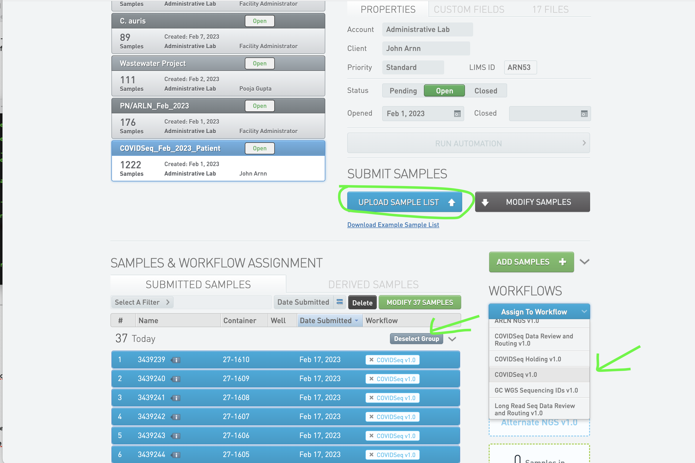

# General_LW_scripts
The scripts that UPHL uses to download things from basespace and run respective workflows

# USAGE

## accession_for_clarity.py

accession_for_clarity.py is a script that creates an accessioning file for Clarity that has the new samples found in the Labware lims system that will be ready for the lab to process. The output of the script is a csv file, that must be saved as an excel file before Clarity will accept it. To be able to run the script you must have these two servers mounted on your computer; smb://172.16.109.9 and smb://168.180.220.43 or //LABWARE/ and ///DDCP/UPHL/. You also need to log into Clarity and download all samplesheets from projects with a name that starts with COVIDSeq, including the project COVIDSeq_From_TEST_DO_NOT_PUT_IN_WORKFLOW. Do this by going to the 'Projects and Samples' tab, choosing the correct project, and clicking the modify samples button. This will insure we do not place duplicates in Clarity which causes many issues.


Files will be downloaded from clicking the modify samples button. 

Now to run the script 

```bash
python accession_for_clarity.py "path/to/files/fromclarity" "path/to/files/fromclarity.etc" ...
```

The csv file that the script creates will be saved to the directory that you are running the script from. You must open the file in excel and save it to the excel file. Now back in Clarity click the button 'Upload Sample List' and choose the excel file.



Now click select group for the samples you just uploaded. Then choose 'Covidseq v1.0' after clicking 'Assign to Workflow'. And finally you are done!

## analysis_for_run.py
This script is written to run continuously on the Linux workstation on a screen. It's main purpose is to use the ```bs``` or "The BaseSpace Sequence Hub CLI tool" to look for new sequencing runs starting on any of the sequencers. It uses a .txt file called 'experiments_done.txt' to record which sequencing runs it has already seen. Once it has identified the new run; it will use the Clarity API to find which species are among the samples. The script will then open a new screen and start the next script ```screen_run.py```. If it was able to find the run on Clarity it will provide an argument for the run type; currently either mycosnp or grandeur. 

USAGE: Run this on a screen. It is an infinite loop and looks for new runs.

EXAMPLE:
```bash
python3 analysis_for_run.py
```

## screen_run.py

This script is written to run on a screen named after a sequencing run and will end the screen once it has completed. 

To run effectively, a run name should be supplied. If the ultimate goal is run through an established workflow, there are flags that can be set that provide additional functionality.

EXAMPLE:
```bash
# for grandeur
python3 screen_run.py -r UT-M70330-240131 --grandeur

# for mycosnp
python3 screen_run.py -r UT-M70330-240131 --mycosnp
```


## merge_c_auris_LIMS_export_files.py

This script is used to gather sample metadata from recent sequencing runs of C. auris and to extract any additional data required in C. auris WGS analysis requests.

The C. auris LIMS export consists of two reports:

1. ‘C_AURIS_Positive_Colony_Daily.csv’ which contains patient metadata for detection of colonization of Candida auris.
2. ‘C_AURIS_Positive_Isolates_Daily.csv’ which contains patient metadata for confirmed C. auris isolates.
   
Both reports are generated daily and found on the LABWARE server currently located at the path below and must be copied to the location/directory of the merge_c_auris_LIMS_export_files.py script.

```
PATH:
(smb://172.16.109.9) at ‘/Volumes/LABWARE/Shared_Files/PHT/C_AURIS_DAILY’
```

This script:

1. Uses the pandas library to read both CSV reports into dataframes.
2. Opts out of redundant columns.
3. Merges both reports.
4. Exports the merged data into an Excel file.
5. Creates a parent directory (C_auris_LIMS_export_*date*) for the saved Excel file.
6. Deletes the copied C. auris LIMS csv reports
   
EXAMPLE:
```bash
python merge_c_auris_LIMS_export_files.py
```

The resulting merged Excel file assists in gathering City/State data for each sequenced C. auris sample as well as gathering collection dates and specimen types.

## healthcare_facility_of_origin_city.py

This script is used to determine the 'Healthcare_Facility_of_origin' city that is associated with various C. auris samples. 

The script expects the following two input files, which must be in the same location/directory as the 'healthcare_facility_of_origin_city.py' script. Currently they are located at:

```
PATH:
/Volumes/IDGenomics_NAS/pulsenet_and_arln/investigations/C_auris/complete_UPHL_analysis/C_auris_LIMS_export
```

1. 'samples.txt': This file contains data about the C. auris samples that is gathered from the C. auris LIMS export. It must include the following headers:
ARLN_Specimen_ID, Healthcare_facility_of_origin_name, Healthcare_facility_of_origin_state.
2. 'C_auris_Healthcare_Facility_of_origin_name_city_state.txt': This file contains a list of healthcare facilities along with their corresponding cities and states. As additional cities are determined in future, they will be added by the user who can find the city through Google search. Please note that if the city cannot be determined, then null should be used.

This script:

1. Uses pandas to read the input files and if there's an error in reading the files, it logs the error and exits the script.

2. Merges the two dataframes on the Healthcare_facility_of_origin_name and Healthcare_facility_of_origin_state columns. If merging fails, it logs the error and exits.

3. In cases where the city information is missing, it fills these gaps with 'NULL'.

4. Writes the merged data to an Excel file (facility_city_output.xlsx). If there's an error during this process, the script logs this error.

5. Uses the logging module for error logging, which helps in debugging and maintaining the script.

6. The script uses the sys module for system-level operations like exiting the script upon encountering an error.

EXAMPLE:
```bash
python healthcare_facility_of_origin_city.py
```

The resulting Excel file helps reduce time in determining what city the 'Healthcare_facility_of_origin_name' is located in.

## gather_vcfs.sh

This script aids the user in gathering sample VCF (Variant Call Format) files from mycoSNP result directories. It is designed to efficiently copy and organize .g.vcf.gz and .g.vcf.gz.tbi files for specific samples and runs, facilitating subsequent WGS analysis. Users must create an empty directory named 'vcf_files' and a file named 'samples.txt' in the same location as this script. The samples.txt should contain two tab-separated columns: the first being the sample IDs and the second the run IDs. Example format: 302****\tUT-M07101-2112**.

This script:

1. Copies VCF Files: The copy_files function is the core of the script. It searches for VCF files in two specific directories, copying them to 'vcf_files/' if they don't already exist there.

2. Search Directories: Searches the following two directories for vcf files. 
    Primary Directory: /Volumes/IDGenomics_NAS/fungal/{run_id}/
    Secondary Directory: /Volumes/IDGenomics_NAS/fungal/mycosnp_vcfs_211208-230726 

3. Error and Success Handling: Prints a message for each sample, indicating whether copying was successful or if it failed.

4. Parallel Processing: Uses GNU Parallel to process multiple entries from samples.txt, enhancing efficiency.

EXAMPLE (Ensure that 'samples.txt' is correctly formatted and present in the same directory as the script as well as the 'vcf_files' directory for successful execution):
```bash
bash gather_vcfs.sh
```

The script will populate the vcf_files directory with the desired VCF files. Each outcome (success or failure) is communicated to the user via terminal messages.

This script streamlines the process of collecting and organizing necessary data for mycoSNP analysis. It significantly reduces manual data handling and potential errors.


## changeseqids.py

This script updates sequence identifiers in the 'vcf-to-fasta.fasta' file, which is an output file of mycoSNP. It ensures that sequence IDs in the 'vcf-to-fasta.fasta' file, used in creating a Newick file, align with the specific naming conventions set by the CDC's Mycotic Disease Branch. Users must place three specific files in the same directory as this script:

1. seqid.txt: A user-created, tab-separated file with headers "current_seqid" and "alternate_seqid".

Example:
```
current_seqid	alternate_seqid
3437***_S24	UT-UPHL-CAU-2*_Houston_TX
3437***_S25	UT-UPHL-CAU-3*_Houston_TX
```

2. original.fasta: A copy of the vcf-to-fasta.fasta file that needs ID alteration.

3. corrected.fasta: An empty file where the script will write the modified data.

The script:

1. Dictionary Creation: Reads the seqid.txt file and constructs a dictionary mapping the current sequence IDs (current_seqid) to their corresponding alternate IDs (alternate_seqid).

2. File Processing: Opens original.fasta for reading and corrected.fasta for writing.

3. Sequence identifiers in original.fasta are replaced with alternate IDs from the dictionary, preserving the integrity of the FASTA file format.

4. Output: The resulting corrected.fasta file contains the FASTA sequences with updated sequence identifiers. This file is suitable for generating a Newick file for phylogenetic analysis.

Example: Before running the script, ensure that 'seqid.txt', 'original.fasta', and 'corrected.fasta' are correctly prepared and located in the same directory as the script.
```bash
python changeseqids.py
```

This script aids in the preparation of C. auris sequence data for phylogenetic analysis. It automates the often tedious and error-prone process of manually updating sequence identifiers via MEGA 11 (Molecular Evolutionary Genetics Analysis version 11).

## bssh_reads_by_run.py

This script will download fastq files when given a run name with `-r` and an output directory with `-o`. This script should only be used if there were no sample sheet issues. Otherwise, manual downloading is recommended.

EXAMPLE:
```bash
python3 bssh_reads_by_run.py -r UT-M70330-240131 -o  /Volumes/IDGenomics_NAS/pulsenet_and_arln/UT-M70330-240131/reads
```

## cecret_mev_to_lw8.py

Generates a LabWare 8 import file by parsing Cecret results.

Inputs:
- Cecret summary (for clade info)
- Sample Sheet (to capture all samples, including zero-read failures)
- Run Name (must be explicitly provided via the --run_name flag; it is not inferred from the directory)

EXAMPLE:
```bash
python3 cecret_mev_to_lw8.py --run_name UT-VH00770-251114 --results cecret/cecret_results.csv --samplesheet SampleSheet.csv
```

## bssh_sample_sheet.py

This script will download the sample sheet of a run when given a run name with `-r` and an output directory with `-o`. This script should only be used if there were no sample sheet issues. Otherwise, manual downloading is recommended.

EXAMPLE:
```bash
python3 bssh_sample_sheet.py -r UT-M70330-240131 -o  /Volumes/IDGenomics_NAS/pulsenet_and_arln/UT-M70330-240131/reads
```

## sample_sheet_to_df.py

This python script will take a MiSeq sample sheet, look for a specific string that _should_ designate the header, and then create a pandas datafame for use in other scripts.

If used as a standalone, will create a csv file without the extra header needed for fastq generation.

EXAMPLE:
```bash
python3 samplesheet_to_df.py -s sample_sheet.csv -o new_sample_sheet.csv 
```

## aws_sample_sheet_grandeur_create.py

This script will take a run_name, sample sheet, and directory of reads to create a sample sheet compatible with aws.

EXAMPLE:
```bash
aws_samplesheet_grandeur_create.py -r UT-M03999-240627
```

Afterward, the idea is to just `cd` into the directory of the reads and upload everything to the AWS S3 bucket.

```bash
run=UT-M03999-240627
directory=/Volumes/IDGenomics_NAS/pulsenet_and_arln/$run/reads
cd $directory
aws s3 cp --profile 155221691104_dhhs-uphl-biongs-dev --region us-west-2 aws_sample_sheet.csv s3://dhhs-uphl-omics-inputs-dev/$run/aws_sample_sheet.csv
ls *fastq.gz | parallel aws s3 cp --profile 155221691104_dhhs-uphl-biongs-dev --region us-west-2 {} s3://dhhs-uphl-omics-inputs-dev/$run/{}
```

## grandeur_to_sheets.py

This script takes a MiSeq sample sheet and the directory of grandeur results (regardless of where they were run) and creates two files to make it "easy" to get results into the "Finished" and "ARLN_regional" tabs.

EXAMPLE:
```bash
python3 grandeur_to_sheets.py -g aws_results -s SampleSheet.csv -r run_name
```

Four files are generated:
- arln_tab.tsv : tab-delimited results relevant to the "ARLN_regional" tab.
- arln_tab.txt : ";" -delimited results relevant to the "ARLN_regional" tab.
- finished_tab.tsv : tab-delimited results relevant to the "Finished" tab.
- finished_tab.txt : ";" -delimited results relevant to the "Finished" tab.

## mev_cecret_to_sheets.py

This script merges sequencing output (from the "Cecret" pipeline) with a sample sheet based on a run name provided as a command-line argument. It creates a standardized tracking file by selecting specific columns, adding placeholders for manual entry, and validating that the detected organism is Measles (Morbillivirus hominis), flagging the row if it is not. The file can then be copied into WGS Tracking Google Sheet.

Example
```
python3 /General_LW_scripts/mev_cecret_to_sheets.py <run name>
```
Generates a file called wgs_tracking_formatted_data.csv in the run folder.

## run_cecret_measles_2.sh

This script copies measles wastewater samples and starts the cecret workflow.

```
# replace with actual run name from /Volumes/NGS/Output/
run=251031_VH00770_193_AAH5JWVM5
run_cecret_measles_2.sh $run
```

